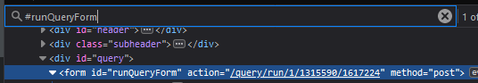

# [SEDE Auth](https://github.com/NearHuscarl/sede-auth)

This API allows you to authenticate as a Stackoverflow user. When logged in, you can
execute [Stack Exchange Data Explorer](https://data.stackexchange.com/) (SEDE) queries via REST API.

## Overview

Normally, you can retrieve various info about users, posts, scores... on
Stackoverflow using the official [SE API](https://api.stackexchange.com/docs).
But due to the brittle nature of REST API, it does not allow you to construct
[many](https://data.stackexchange.com/stackoverflow/query/4038/find-interesting-unanswered-questions)
[complex](https://data.stackexchange.com/stackoverflow/query/161411/site-activity-and-votegraph)
[queries](https://data.stackexchange.com/stackoverflow/query/3543/elite-users-those-who-hold-x-of-all-reputation)
without making multiple sub-optimal requests, sometimes the task is not feasible at all.

SEDE on the other hand, is an SQL playground where you can execute arbitrary
queries to get, transform, combine or aggregate the data however you want.
Remember, you are using SQL which is a whole-ass query language instead of a
couple of predefined methods with hardcoded params to get the data.

The problem is that the SE API (which sucks ball) is official and supported
while the SEDE does not have any formal API. Thus, this project happens. It
provides you a way to authenticate the users and get the auth cookie in return.

When you compose a new query in SEDE, you create an endpoint. Everytime
you edit and run the query, a new endpoint with a corresponding revision is generated. To
use the endpoint, you must pass the auth cookie as mentioned previously.

Comparisons between SEDE and SE API:

| SEDE API     | SE API        |
|----------  |---------------|
| :x: Unofficial | :heavy_check_mark: Official |
| :x: Updated once a week | :heavy_check_mark: Up-to-date   |
| :x: Method: `GET` | :heavy_check_mark: Methods: `GET`, `POST`, `DELETE` (*) |
| :heavy_check_mark: Can construct complex queries. Timeout is the only limitation | :x: Cannot construct complex queries. Its existence is the limitation |
| :heavy_check_mark: Max 50,000 rows per request | :x: Max `pagesize`: 100 per request |
| :heavy_minus_sign: Quotas: Unknown | :heavy_check_mark: Quotas: 10,000 per day |
| :x: Can only access public data | :heavy_check_mark: Can access user's private data |

<sup>*Certain requests require an access token</sup>

## Getting started

* Clone this project
* `npm install`
* `npm start`
* Open your browser and paste the code below to the console:

```javascript
body = new URLSearchParams({
  email: 'your.email@gmail.com',
  password: 'your_password',
})
fetch('http://localhost:80/auth', { method: 'POST', body })
  .then(res => res.json())
  .then(data => console.log(data))
```

## Usage

```
/                                         Shows this help
/auth                                     Authenticates the user
/query/run/:siteId/:queryId/:revisionId   Executes the query
```

### `/`

Shows this help

### `/auth` `POST`

Authenticates the user using Stackoverflow account to grant access to the SEDE API

**Body**: Form Data

```json
{
  "email": "your.email@gmail.com",
  "password": "your_password"
}
```

**Response**

```json
{
  "authCookie": ".ASPXAUTH=..."
}
```

### `/query/run/:siteId/:queryId/:revisionId` `POST`

Executes the query. It has 3 parameters:
* `:siteId`: The ID of the site. `1` for Stackoverflow. See the full list of all site IDs [here](https://data.stackexchange.com/sites).
* `:queryId`: ID of the query.
* `:revisionId`: ID of the query revision. Think of it like a commit hash in git history.

**Headers**

```json
{
  "auth-cookie": ".ASPXAUTH=..."
}
```

**Body**: Form Data

The number of the params in the body depends entirely on the query itself

This query has no params

```sql
SELECT * FROM VoteTypes
```

This query has one required parameter: `userId`

```sql
SELECT * FROM Users WHERE Id = ##userId##
```

Example request Body:

```json
{
  "userId": "1"
}
```

This query has one optional parameter and one required parameter. If 
`minScore` is not provided, it uses the default value `300`.

```sql
SELECT * FROM Posts
WHERE Score > ##minScore:int?300##
  AND Tags LIKE '%' + ##tag:string## + '%'
```

Example request Body:

```json
{
  "tag": "py"
}
```

**Response**

```json5
{
  "resultSets": [
    { /* Table 1 */ },
    { /* Table 2 */ },
    ...
  ]
}
```

You can create a whitelist of origins that are allowed to call the API. Create `.env.local` in the root
directory with the following content:

```
ORIGIN_WHITELIST=https://example-1.com,http://example-2.com
```

By default, the whitelist contains all origins. Once you define your own whitelist, any origins not from
that list will be blocked.

## Example

The example below demonstrates the workflow to create a query and then use the newly generated SEDE API endpoint
to execute the query.

* Go to [SEDE](https://data.stackexchange.com/). Create a new account if you don't have one.

* Hit Compose Query to create a new SQL query and paste the code below

```sql
-- UserId: User ID
DECLARE @userId INT = ##UserId:int##
-- MinPost: Min number of posts
DECLARE @minPost INT = ##MinPost:int?5##
-- TopTags: Top n Tags
DECLARE @topTags INT = ##TopTags:int?10##

SELECT TOP (@topTags)
  Tags.tagName,
  SUM(CASE WHEN Posts.PostTypeId = 1 THEN Posts.Score ELSE 0 END)
    AS [Total Question Score],
  SUM(CASE WHEN Posts.PostTypeId = 1 THEN 1 ELSE 0 END)
    AS [Question Posts],
  SUM(CASE WHEN Posts.PostTypeId = 2 THEN Posts.Score ELSE 0 END)
    AS [Total Answer Score],
  SUM(CASE WHEN Posts.PostTypeId = 2 THEN 1 ELSE 0 END)
    AS [Answer Posts],
  SUM(Posts.Score) AS [Total Score],
  COUNT(*) AS [Post Count],
  ROUND(AVG(CAST(Posts.Score AS FLOAT)), 1, 1) AS [Average Score]
FROM Posts
JOIN PostTags
  ON Posts.Id = PostTags.PostId OR Posts.ParentId = PostTags.PostId
JOIN Tags
  ON PostTags.TagId = Tags.Id
WHERE Posts.OwnerUserId = @userId
GROUP BY Tags.tagName
HAVING COUNT(*) >= @minPost
ORDER BY [Average Score] DESC
```

* The script above retrieves the user's average score in the top n tags, it exposes
some [parameters](https://data.stackexchange.com/help#parameters), so you don't have to modify the code everytime you want to change the filters

* Once you execute the script, open the inspector and search for the form action like below 

    * Alternatively you can run this code in the console to get the action url
    
    ```javascript
    document.querySelector('#runQueryForm').getAttribute('action')
    ```

* Then paste and execute this code in your console. Remember to [login](#getting-started) to get access to the auth cookie
before that.

```javascript
body = new URLSearchParams({
  UserId: 1,
  MinPost: 5,
  TopTags: 10,
})
headers = { 'Auth-Cookie': 'ASPXAUTH=...' }
fetch('http://localhost:80/query/run/1/1315590/1617224', { body, headers, method: 'POST' } )
  .then(r => r.json())
  .then(data => console.log(data))
```

The result will look like this:

```json5
{
  "columns": [
    {
      "name": "tagName",
      "type": "Text"
    },
    {
      "name": "Total Question Score",
      "type": "Number"
    },
    {
      "name": "Question Posts",
      "type": "Number"
    },
    {
      "name": "Total Answer Score",
      "type": "Number"
    },
    {
      "name": "Answer Posts",
      "type": "Number"
    },
    {
      "name": "Total Score",
      "type": "Number"
    },
    {
      "name": "Post Count",
      "type": "Number"
    },
    {
      "name": "Average Score",
      "type": "Number"
    }
  ],
  "rows": [
    [ "sql", 1182, 2, 112, 3, 1294, 5, 258.8 ],
    [ "c#", 3563, 3, 1089, 20, 4652, 23, 202.2 ],
    [ "sql-server", 1275, 4, 395, 8, 1670, 12, 139.1 ],
    [ ".net", 2043, 4, 343, 17, 2386, 21, 113.6 ],
    ...
  ]
}
```

## Deployment

Deploy using heroku

```bash
git add . && git commit -m 'initial commit'
heroku create sede-auth
git push heroku master
```

## Credit

Big thanks to [*Glorfindel*](https://meta.stackexchange.com/a/341993/860277) for the original implementation in Java

<!-- ## TODO

-- - [ ] Main page
-- - [ ] Convert to Typescript
-- - [ ] Use `debug()` instead of `console.log()`
-- - [ ] Remove TODO
